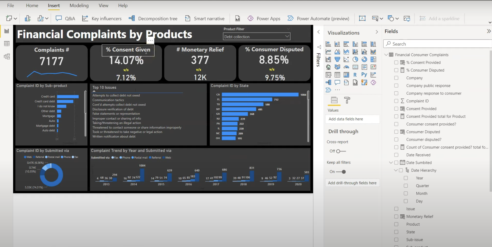
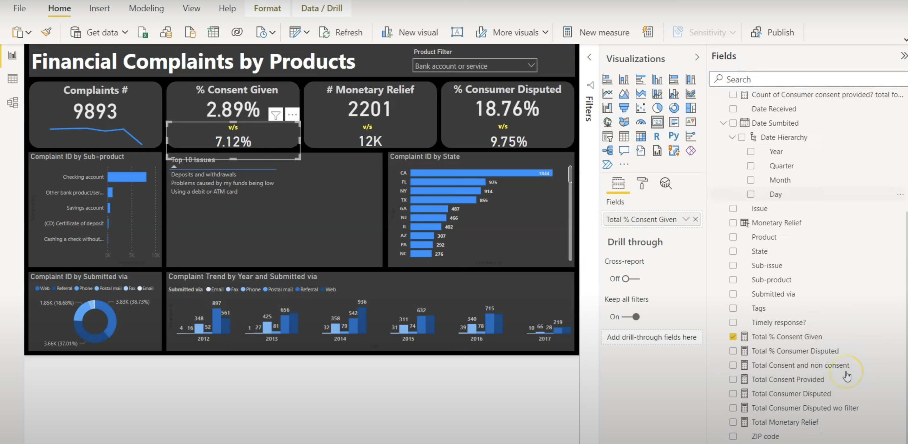
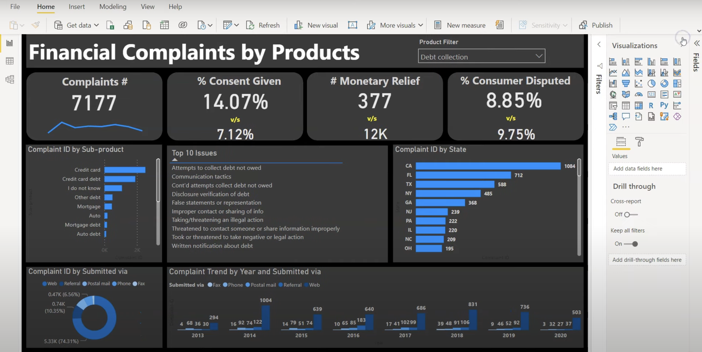

# Financial-Dashboard-PowerBI
This research focuses on how to develop a financial dashboard in Power BI for reporting financial complaints. I have utilized intermediate-level DAX and detailed the dashboard's features in this Power BI sample dashboard.

# Data Analysis by Power BI

# Dashboard of Power BI

